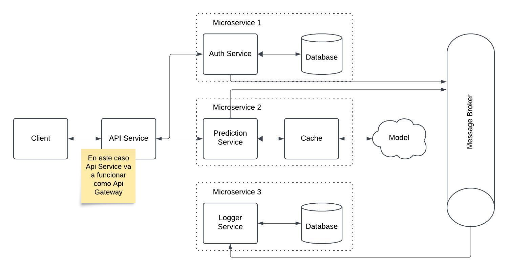

# 🏗️ Arquitectura de Microservicios con Flask, RabbitMQ y MongoDB


Este proyecto implementa una **API de predicción** con **autenticación basada en API Keys**, **limitación de solicitudes** y **registro de logs de manera asíncrona** mediante **RabbitMQ**. Está diseñado bajo una arquitectura de **microservicios** utilizando **Flask, MongoDB, Redis y Docker**.


---

## 📌 Índice

1. [🔧 Características principales](#características-principales)
2. [📂 Estructura del proyecto](#estructura-del-proyecto)
3. [🏗️ Arquitectura](#arquitectura)
3. [🚀 Instalación y configuración](#instalación-y-configuración)
4. [🔄 Flujo de trabajo](#flujo-de-trabajo)
5. [📝 Endpoints disponibles](#endpoints-disponibles)
6. [🐇 RabbitMQ Management](#rabbitmq-management)
6. [📊 Pruebas y monitoreo](#pruebas-y-monitoreo)
7. [📝 Pruebas HTTP](#pruebas-http)
8. [🛠 Detener los Servicios](#detener-los-servicios)
9. [📌 Pendientes y Mejoras Futuras](#pendientes-y-mejoras-futuras)
10. [📜 📑 ADR (Architectural Decision Records)](#adr-architectural-decision-records)

---

## 🔧 Características principales

✔️ **Autenticación con API Key** (Freemium/Premium)\
✔️ **Rate limiting** para controlar el número de solicitudes por tipo de suscripción\
✔️ **Cache con Redis** para mejorar el rendimiento\
✔️ **RabbitMQ para logs asíncronos**\
✔️ **MongoDB como base de datos principal**\
✔️ **Arquitectura basada en microservicios**\
✔️ **Pruebas de carga con Locust**\
✔️ **Docker Compose para fácil despliegue**

---

## 📂 Estructura del proyecto

```
├── microservices/
│   ├── api_service/          # Servicio API principal
│   ├── auth_service/         # Servicio de autenticación
│   ├── prediction_service/   # Servicio de predicción
│   ├── logger_service/       # Servicio de logs
│   ├── load_tests/           # Pruebas de carga con Locust
│   ├── scripts/              # Scripts de pruebas HTTP
│   ├── docs/                 # Documentación y ADRs
│
├── docker-compose.yml        # Orquestación de contenedores
├── README.md                 # Documentación del proyecto
```

---
## 🏗️ Arquitectura



---
## 🚀 Instalación y configuración

### ✅ Requisitos previos

Antes de empezar, asegúrate de tener instalados:

- **Docker** y **Docker Compose**
- **Python 3.9+**
- **Postman** (opcional para pruebas de API)

### ⚙️ Pasos para ejecutar el proyecto

1️⃣ **Clonar el repositorio**

```sh
git clone https://github.com/jdromerorajoy/TT2-MG-IS-2024.git
cd TT2-MG-IS-2024
```

2️⃣ **Levantar los contenedores con Docker**

```sh
docker-compose up --build -d
```

3️⃣ **Verificar que los servicios estén corriendo**

```sh
docker ps
```

4️⃣ **Ver logs de algún servicio**

```sh
docker-compose logs -f api_service
```

5️⃣ **Probar la API con Postman o cURL**

---

## 🔄 Flujo de trabajo

1. El **cliente** realiza una petición `POST /predict` con su **API Key**.
2. El **Auth Service** valida la API Key y determina el nivel de suscripción (`freemium` o `premium`).
3. El **Rate Limiter** restringe el número de solicitudes según la suscripción.
4. La API consulta el **cache en Redis** para respuestas rápidas.
5. Si no está en caché, el **Prediction Service** ejecuta el modelo y guarda la respuesta.
6. Todos los eventos se registran en **RabbitMQ** y son procesados asíncronamente por el **Logger Service**.

---

## 📝 Endpoints disponibles

### 🔐 Autenticación

#### `POST /validate`

**Descripción:** Verifica si la API Key es válida.\
**Ejemplo de petición:**

```sh
curl -X POST http://localhost:8001/validate \
     -H "Content-Type: application/json" \
     -d '{"api_key": "freemium_key"}'
```

**Respuesta esperada:**

```json
{"valid": true}
```

---

### 🔮 Predicción

#### `POST /predict`

**Descripción:** Retorna la probabilidad de similitud entre dos entidades.\
**Ejemplo de petición:**

```sh
curl -X POST http://localhost:8000/predict \
     -H "Authorization: premium_key" \
     -H "Content-Type: application/json" \
     -d '{"inputs": ["87441,1,417881", "87442,1,417881"]}'
```

**Respuesta esperada:**

```json
{
  "probabilidad": 0.87,
  "cached": false
}
```
---

## 🐇 RabbitMQ Management

Para acceder al panel de administración de RabbitMQ:

1. Abre tu navegador y accede a `http://localhost:15672`
2. Ingresa con las credenciales `user:password`
3. Explora las colas y mensajes en el panel de control.
4. Puedes ver los logs de los servicios en tiempo real.
5. ¡Listo! 🚀

---

## 📊 Pruebas y monitoreo

### 🔥 Pruebas de carga con Locust

Para evaluar el rendimiento y límites del API:

1. Levantar Locust:
   ```sh
   docker-compose up locust
   ```
2. Acceder a `http://localhost:8089`
3. Configurar el número de usuarios y tasa de spawn.
4. Iniciar la prueba y analizar resultados.

---

## 📝 **Pruebas HTTP**

Los archivos de prueba se encuentran en la carpeta `scripts/`.
Puedes probar los endpoints usando archivos `.http` directamente en **VS Code**.

### 📌 **Ubicación de los archivos**

```
/scripts
   ├── test.http
```

### ✅ **Ejecutar pruebas en VS Code**

1. Instala la extensión **REST Client** en VS Code.
2. Abre cualquier archivo `.http` dentro de `scripts/`.
3. Haz clic en `Send Request` en la parte superior de la solicitud.

---

## 🛠 **Detener los Servicios**

Para detener los servicios ejecuta:

```bash
docker-compose down
```

Si deseas eliminar los volúmenes de la base de datos:

```bash
docker-compose down -v
```

---

## 📌 **Pendientes y Mejoras Futuras**
- Implementar métricas para evaluar tiempos de respuesta.
- Agregar autenticación robusta con JWT.
- Mejorar la documentación con diagramas de arquitectura.


## 📜 📑 ADR (Architectural Decision Records)

Este proyecto documenta las decisiones arquitectónicas tomadas mediante **ADR**. 

### 📌 Lista de ADRs:

| **ADR**                         | **Descripción** |
|---------------------------------|--------------|
| [ADR-001](docs/adrs/adr-001.md) | Uso de modelo ya entrenado en lugar de entrenar en tiempo real. |
| [ADR-002](docs/adrs/adr-002.md) | No se utiliza UUID en logs, sino identificación por microservicio. |
| [ADR-003](docs/adrs/adr-003.md) | Se usa `api_service` en lugar de un API Gateway en entorno local. |

Cada ADR se encuentra documentado en la carpeta **`docs/`**.

📌 **Para más detalles sobre las decisiones arquitectónicas, consulta los archivos en `docs/`.** 🚀


